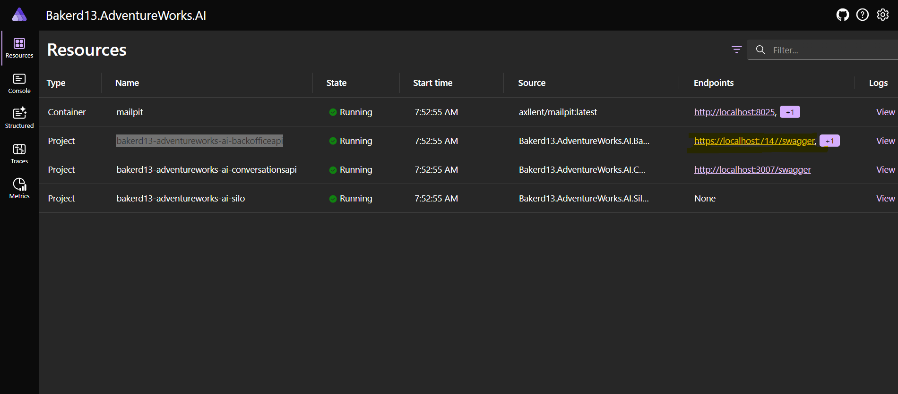
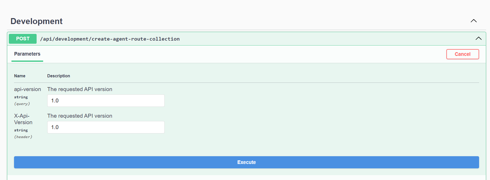

# Description

This is the backend to the AdventuresWorks and the purpose is to act as the gateway for the frontend.

## Installation and Instruction

1. Download the AdventureWorks database

navigate to https://learn.microsoft.com/en-us/sql/samples/adventureworks-install-configure?view=sql-server-ver16&tabs=ssms and follow the instructions. for Sql server 2022

copy the dowloaded backup and place in ${repo root}/backend/adventureWorks_data/sqlserver/backups

this will be restored into sql server on first startup.

2. Configure openai api key and the sql server password

navigate to ${repo root}/backend/src/AdventureWorks.Shop.AI.AppHost

run

dotnet user-secrets set Parameters:sa-password <a strong password>

dotnet user-secrets set Parameters:ai-key <openai api key>

Appsettings of the AdventureWorks.Shop.AI.AppHost project you may be required to change the ip address of VectorDatabaseEndpoint

```
"Services": {
  "VectorDatabaseEndpoint": "host.docker.internal"
},
"AIService": {
  "Type": "OpenAI",
  "Endpoint": "", // ignored when AIService is "OpenAI"
  "Key": "Overriden by secrets"
}
```

4. Make sure milvus vector database is running

```bash
cd ${repo root}/tools/milvus_vectordb
docker compose up
```

5. Run or use f5 in visual studio

```bash
cd ${repo root}/backend/AdventureWorks.Shop.AI/AdventureWorks.Shop.AI.AppHost
dotnet run
```

6. Navigate to the Aspire dashboard example https://localhost:17053/login?t=28e1cdb04e74f911fb27cac0d07b107d found in the running console or 

7. Click on adventureworks-shop-ai-backofficeapi endpoint to navigate to the swagger end point



In swagger try the create_agent_route_collection and then execute, this will seed the milvus vector database with routes for the agents created in the project



8. Launch the Mailpit development website from the Aspire dashboard, this is required to view the email sent by Orleans reminders.


  ```

