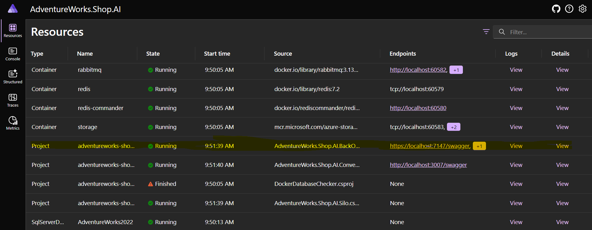

# Description

This is the backend to the AdventuresWorks backend and the purpose is to act as the gateway for the frontend.

## Installation and Instruction

1. Download the AdventureWorks database

navigate to https://learn.microsoft.com/en-us/sql/samples/adventureworks-install-configure?view=sql-server-ver16&tabs=ssms and follow the instructions. for Sql server 2019 or 2022

2. Create the Conversations database.

Within SSMS open file ${repo root}/tools/database_script/database_setup.sql and execute that script which setup a Microsoft Orleans databse called adventureworks-shop-ai-orleans-db

3. Configure openai api key and the vector databse ip address

There are two ways but the one I use is by adding environment variables so there not commit to via mistake or updating these variables in appsetting.json in the following projects AdventureWorks.Shop.AI.ConversationsApi, AdventureWorks.Shop.AI.BackOfficeApi.

Adding environment variables

AIService__Key [your api key]
Services__VectorDatabaseEndpoint [your ip]

Appsettings

```
"Services": {
  "VectorDatabaseEndpoint": "PUT IP HERE"
},
"AIService": {
  "Type": "OpenAI",
  "Endpoint": "", // ignored when AIService is "OpenAI"
  "Key": "PUT KEY HERE"
}
```

4. Make sure milvus vector database is running

```bash
cd ${repo root}/tools/milvus_vectordb
docker compose up
```

5. Run

```bash
cd ${repo root}/backend/AdventureWorks.Shop.AI/AdventureWorks.Shop.AI.AppHost
dotnet run
```

6. Navigate to the Aspire dashboard example https://localhost:17053/login?t=28e1cdb04e74f911fb27cac0d07b107d found in the running console

7. Click on adventureworks-shop-ai-backofficeapi endpoint to navigate to the swagger end point



In swagger try the create_agent_route_collection and then execute, this will seed the milvus vector database with routes for the agent created

8. Launch the Mailpit development website from the Aspire dashboard, this is require to view the email sent by Orleans reminders.

9. Connection String

If working on your local machine this should work out of the box

but can be change in the appsettings in the following projects AdventureWorks.Shop.AI.ConversationsApi, AdventureWorks.Shop.AI.Silo.

```
  "ConnectionStrings": {
    "AdventureWorksStoreConnectionString": "Data Source=.;Initial Catalog=adventureworks-shop-ai-orleans-db;Integrated Security=SSPI;TrustServerCertificate=True;",
    "ConversationsConnectionString": "Data Source=.;Initial Catalog=conversations-db;Integrated Security=SSPI;TrustServerCertificate=True;"
  },
  ```

